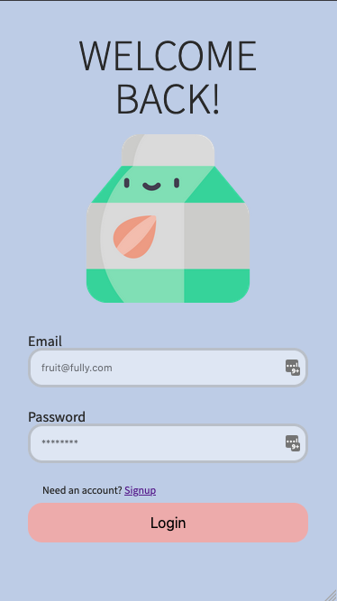
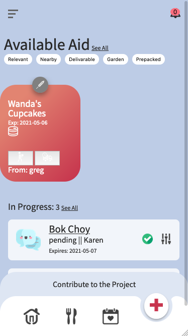

# Food Aid

Assisting in the organization of food mutual aid projects.

## Screenshots

 

#### Challenges

Securing sensitive data:
Do not want submitter data to be sent to client. Should I use delete or destructuring //destructuring introduced by Jerry Lafume

Storing non sensitive user-data:
Should user settings be saved with passport?

learned first promise handling is converting the response stream into a json file

learning how to make unobtrusive flash messages -> for aid submission success/error handling
-> can I use connect flash module?
most usage is refreshing the page and showing the message in a ejs element
is there a way not to require page reload?
Gus (mentor)
confirmed my hesitation on using the module to show a success/fail message. Instead utilizing the response provided by

adding users is so much more trouble

new error occuring when posting a new userSettings
I get a 200 response from the server but catch an error
Uncaught (in promise) Error: SyntaxError: JSON.parse: unexpected character at line 1 column 1 of the JSON data
Realized missing '.' in routes js file when checking dashboard for userSettings '._id'

Need to figure out how to save userSEttings into session. Currently have to load userSettings when needing information. Maybe that's okay for now.

All base funcitonality done. 4/13/2021

ToDo:
  -Update filters in database queries to exclude user self submissions & aid not meeting userSettings & those which are not available
  -Texting Ability (Twilio)
  -Distance Calculation - GeoJSON<->Leaflet?
    -If Can store GeoJSON then database may be able to help calculate and filter distance
  -transaction completion
  add modular

Updating Filters:
  - Initially perplexed on how to setup filter options without disrupting mongo syntax, but then realized I can set the arrays as normal arrays!
  -This is hard
  -Completed filters

User security by removing non current user id's

Scary Learning TWilio since there are so many moving pieces.

Learning about client side SDKs

translating JQuery to vanilla JS

tokenGeneration and handling

translating syntax across twilio technologies

Handling Global Variables and when to refactor code to be cleaner (more variables)

Worried about best practices with client SDK because of limitations of API billing

Conversation States

understanding that the role of the server is to serve auth tokens and handle creating conversations during posts

Ideally a new Twilio conversation would not be started if both participants already have an active conversation for another topic. BUT I don't know how to do that yet and I wanna ship this.

putting certain code after res.send()

to do, on fully completed task, disable chat
write client side requests
write client side chat UI
test

cannot use messages because requires more numbers

does console logging errors essentially help make a stack trace of where errors come from?
functionality in chatWindow completed. Need to link to it.

Ensure that dashboard only renders tasks with active message paths if
have requesting aid auto forward to the chat on client side.

creating a custom error for when req w/o conversation

Check API key for Error re: token generation; Turns out it was a type error re: identity as string
-Twlio Client successful

Error During twilio conversation creation during put 'cyclic dependency detected'
trying to Save an object

resources getting sent

In Chat: fixed await call in async loop

Ooops push notification is not for figuring out unread messages.

testing during refactoring!

Read horizon-not explicitly on documentation
